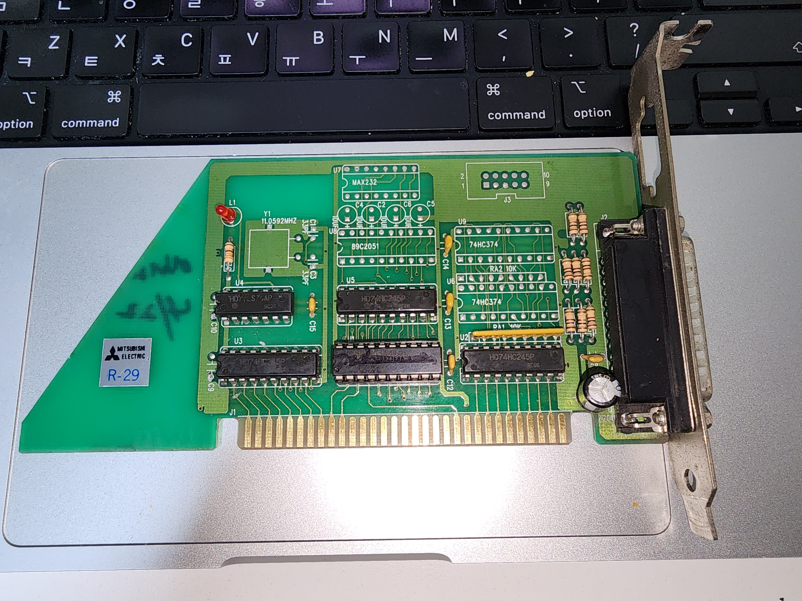
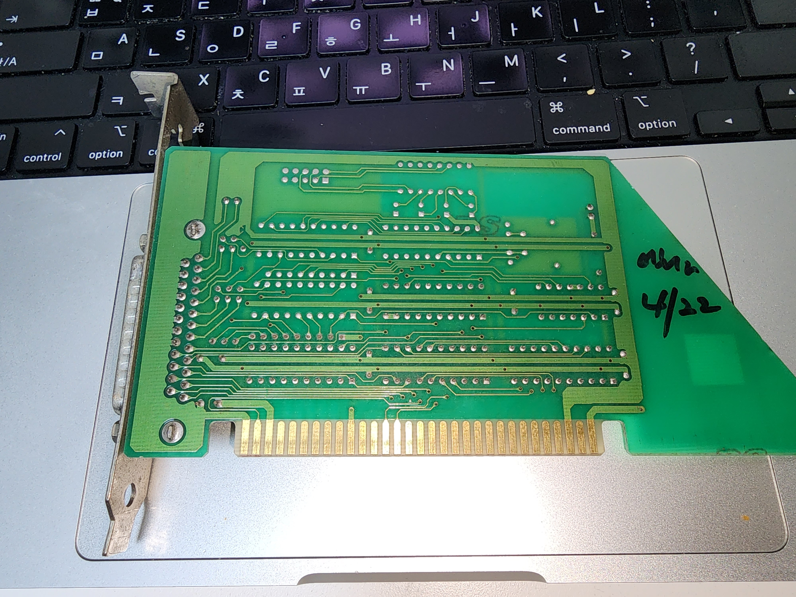
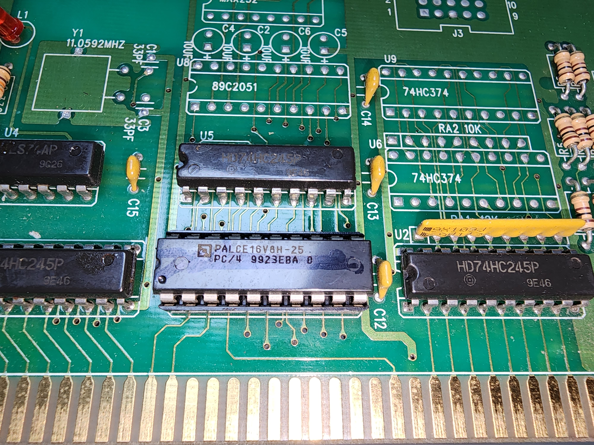

# Open2DJ

A modernization of project the memories of childhood

## Old Machine Specification

This specification is from the machine that I currently own. It depends on EZ2** version to be run, however, I focus on the 1st ~ BErA in this repository.

I tested AEIC and EC on this machine, they worked fine.

|Component|Detail|
|---------|------|
|Processor|Intel Celeron 1.2GHz(1.2x100, Tualatin)|
|Motherboard|Digital Greentek PT-694T-A|
|North Bridge|VIA VT82C694T|
|South Bridge|VIA 82C686B|
|RAM|512MB SD RAM (133MHz)|
|Video|Riva TNT2 M64 32MB|
|Sound|SoundBlaster Live! CT4670|
|Control|Mitsubishi Electric R-29 (As labeled on the card, See figure below) with 1 DB-25 Port|

### Control Card

The control systems of EZ2** series are based on ISA(Industry Standard Architecture) Bus. It has been the great obstacle for the series to upgrade hardwares, causing several performance-related issues.

||
|---|
|Front view|

||
|---|
|Rear view|

|)|
|---|
|Microcontroller Unit (PALCE16V8H25, [Datasheet](docs/datasheets/PALCE16V8.PDF)|

