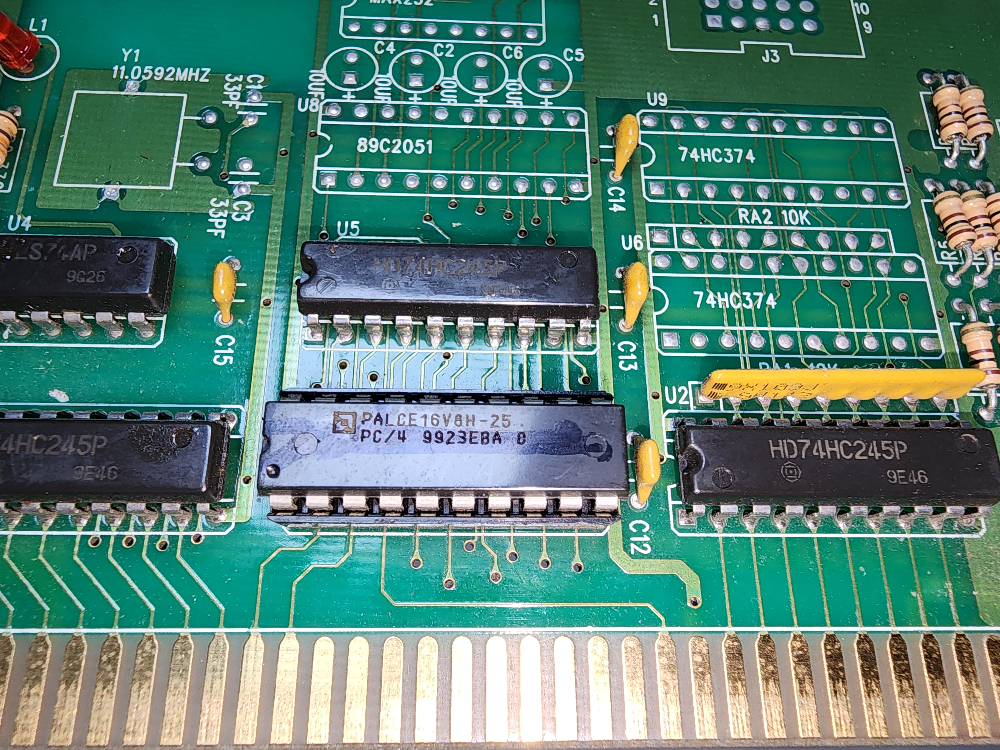

# Control Card
The control systems of EZ2** series are based on ISA(Industry Standard Architecture) Bus. It has been the great obstacle for the series to upgrade hardwares, causing several performance-related issues.

||
|---|
|Front view|

||
|---|
|Rear view|

||
|---|
|Microcontroller Unit (PALCE16V8H25, [Datasheet](datasheets/PALCE16V8.PDF)|

Control card interfaces with [IO Board](IO_BOARD.md).
